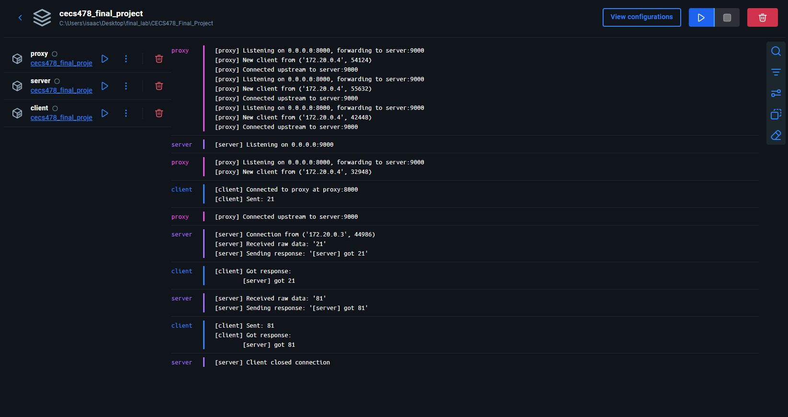

# CECS478_Final_Project
## Overview
The goal of this project was to demonstrate the use of a reverse proxy to harden the sercurity of a web server. Having a middle-man act as a reverse proxy adds a few layers of security: IP obfuscation, Host obfuscation, additionaly filters, and can introduce additional constraints like rate limiting and force authentication. 

## Setup
Make sure docker is installed with the ability to run docker-compose. That should be the only requirement.

## Building and Run
Make sure: 
- You're in the project folder; same directory as `docker-compose.yml`
- Have `make` installed

### To build
```
make up
```
### To run
```
make demo
```
### To build & run
```
make up && make demo
```


**Note:** `make up` also builds the project via `docker-compose up --build`

## Architecture Overview
  

## Demonstration Video
[](assets/video.mp4)
